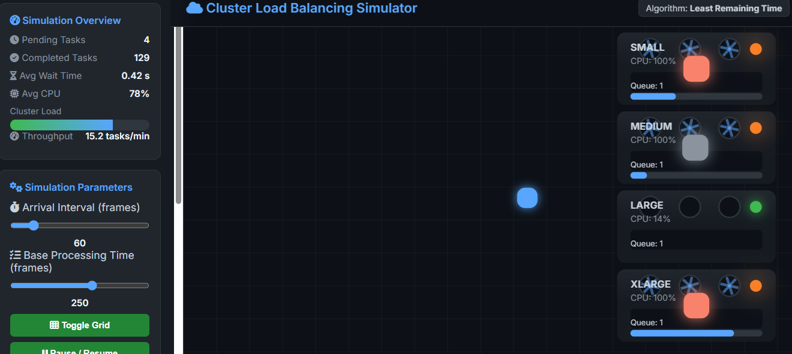

# Cluster Load Balancing Simulator

A simple and interactive simulation of load balancing in heterogeneous server clusters, built with JavaScript and Canvas. Gives a basic comparison of different algorithms like **Least Remaining Time** (LRT) and **Shortest Queue** (SQ ), with metrics calculated in real time, such as average wait time, throughput, and CPU usage.

This tool was made for visually understanding scheduling and balancing in distributed systems, built as a personal project.

[Online Demo](https://alissonvg.github.io/cluster-load-balancing-simulator/) (hosted via GitHub Pages)

 

## Features
- **Real-Time Visualization**: See tasks arriving, queuing, and processing on servers with different speeds.
- **Comparable Algorithms**: Compare between LRT (based on expected delay) and SQ (shortest queue, with tie-break by speed).
- **Modes**:
  - **Sandbox**: Test with sliders for arrival interval, processing time and algorithm which can be altered in real time.
  - **Benchmark**: Fixed parameters, choose the number of tasks (The options are 50, 100 and 200); runs until completion and generates .csv file (TaskID, WaitTime, Server, etc.).
- **Metrics**: Avg Wait Time (s), Throughput (tasks/min), Avg CPU (%), Cluster Load (%).
- **Logs and Export**: Automatic CSV export in benchmark for analysis (e.g., in Excel or Python).

## How to Run
### Locally
1. Clone the repository.
2. Open `index.html` in a browser (Tested in Chrome and Firefox).
3. Choose one of the modes: Sandbox for free tests or Benchmark for tests with fixed parameters.

### Online
- Access the [demo](https://alissonvg.github.io/cluster-load-balancing-simulator/).

No installation required, everything runs in your browser.

## Algorithms Included (so far)
- **Least Remaining Time (LRT)**: Chooses server with lowest expected delay. A basic optimization for heterogeneous clusters.
- **Shortest Queue (SQ)**: Chooses shortest queue, if there's a tie it will choose the fastest server. Simple but less efficient with varying speeds.

## Technologies
- JavaScript
- HTML5 Canvas for visualization and animations
- CSS3 for UI
- No external dependencies (except Font Awesome for icons)

## Contributions are welcome!
- Fork the repo and send a Pull Request with improvements (new algorithms like Round Robin, server scale-out).
- Issues welcome for bugs or suggestions.

## License
[MIT License](LICENSE).

Developed by [Alisson Gauer](https://github.com/alissonvg). Inspired by real-world cloud infrastructure experiences and learnings at Dell Technologies.